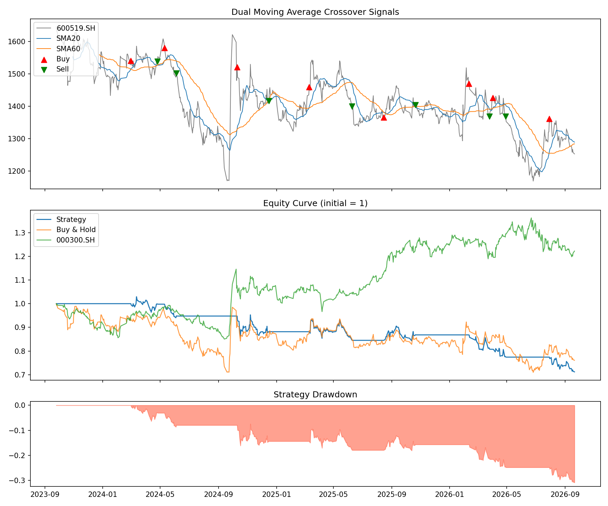
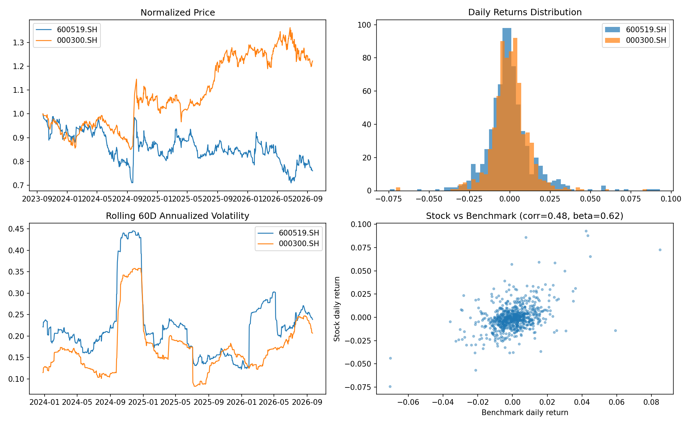

# quant-learning

量化交易自学项目：用 Python 实现一个**双均线交叉策略回测**和一个**金融数据分析（EDA）**小项目。
数据来自 iFinD（同花顺），标的为贵州茅台（600519.SH，前复权日线），基准为沪深300（000300.SH），区间 2023-09-25 ~ 2026-09-21。

> 本项目仅用于学习，不构成任何投资建议。

## 项目结构

```
quant-learning/
├── data/
│   └── prices_raw.csv      # iFinD 导出的日线行情（已随仓库提交，方便直接运行）
├── src/
│   ├── data_loader.py      # 数据加载：CSV -> 收盘价宽表
│   ├── strategy.py         # 策略：双均线交叉（金叉买、死叉卖）
│   ├── backtest.py         # 向量化回测：信号滞后一日 + 交易费用
│   └── metrics.py          # 绩效指标：收益、波动、夏普、最大回撤、卡玛比率等
├── analysis.py             # 金融数据分析 EDA（可视化 + 描述性统计）
├── main.py                 # 主程序：回测 + 绩效对比 + 画图
├── results/                # 运行输出（图表 + 指标 CSV）
└── requirements.txt
```

## 快速开始

```bash
pip install -r requirements.txt

python main.py        # 回测，输出 results/backtest.png、results/metrics.csv
python analysis.py    # 数据分析，输出 results/analysis.png、results/descriptive_stats.csv
python -m src.data_loader  # 预览原始数据
```

## 策略逻辑

- 短期均线（SMA20）上穿长期均线（SMA60）→ 买入持有
- 短期均线下穿长期均线 → 清仓
- 信号在收盘后产生，仓位**下一交易日**生效（避免未来函数）
- 费用：佣金万 2.5（双边），印花税 0.05%（仅卖出）

## 回测结果（2023-09 ~ 2026-09，共 724 个交易日）

| 指标 | 双均线策略 | 买入持有 | 沪深300 基准 |
|---|---|---|---|
| 累计收益 | -28.80% | -23.91% | +22.21% |
| 年化收益 | -11.15% | -9.07% | +7.23% |
| 年化波动率 | 12.54% | 23.40% | 18.18% |
| 夏普比率 | -0.88 | -0.29 | 0.48 |
| 最大回撤 | -30.82% | -29.01% | -15.66% |
| 卡玛比率 | -0.36 | -0.31 | 0.46 |



### 结果解读（很好的学习素材）

1. **策略跑输了买入持有**：单边下跌 + 反复震荡行情中，双均线策略频繁发出假信号（whipsaw），
   每次金叉追入、死叉割出，磨损了收益。这不是代码 bug，而是趋势策略在震荡市中的典型缺陷。
2. **策略波动率明显更低**：因为大部分时间是空仓，回撤形态与持仓完全不同——体现了"择时"的双刃剑效应。
3. **与基准相关性 0.48、Beta 0.62**：茅台与大盘中等相关，且波动弹性小于市场（该区间内）。

## 数据分析（EDA）要点

- 日收益分布呈尖峰厚尾（茅台偏度 1.29、峰度 8.26），不符合正态假设
- 滚动 60 日年化波动率在 10%~45% 之间大幅波动（2024-09 极端行情冲高）
- 详细见 `results/analysis.png` 与 `results/descriptive_stats.csv`



## 可以进一步做的方向

- 参数敏感性分析（SMA 窗口网格搜索，注意过拟合）
- 加入 RSI / MACD 过滤器减少假信号
- 用 `pytest` 给回测引擎写单元测试
- 接入更多标的做组合回测

## 免责声明

回测结果基于历史数据，不代表未来表现。本项目仅供学习交流，不构成投资建议。
